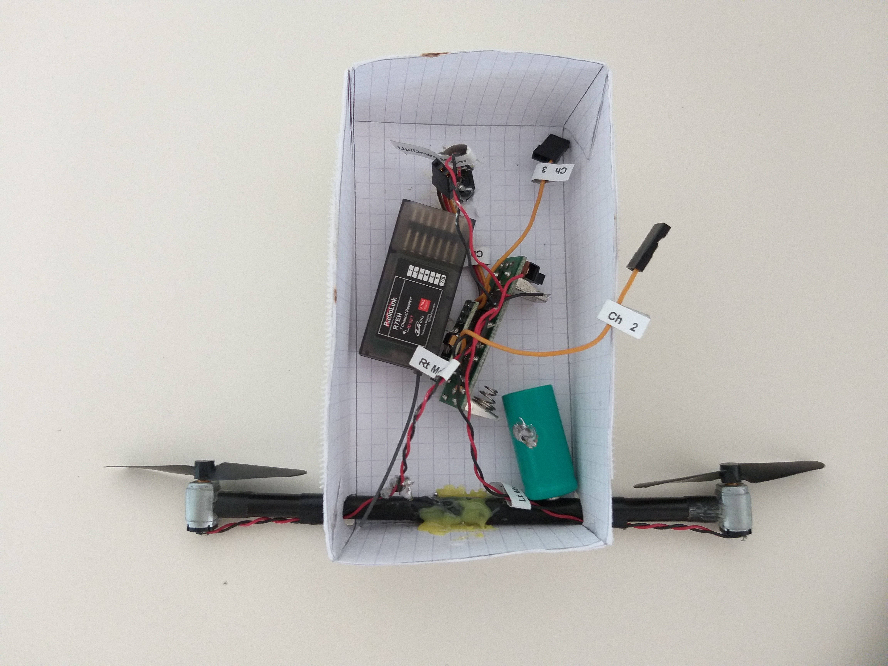
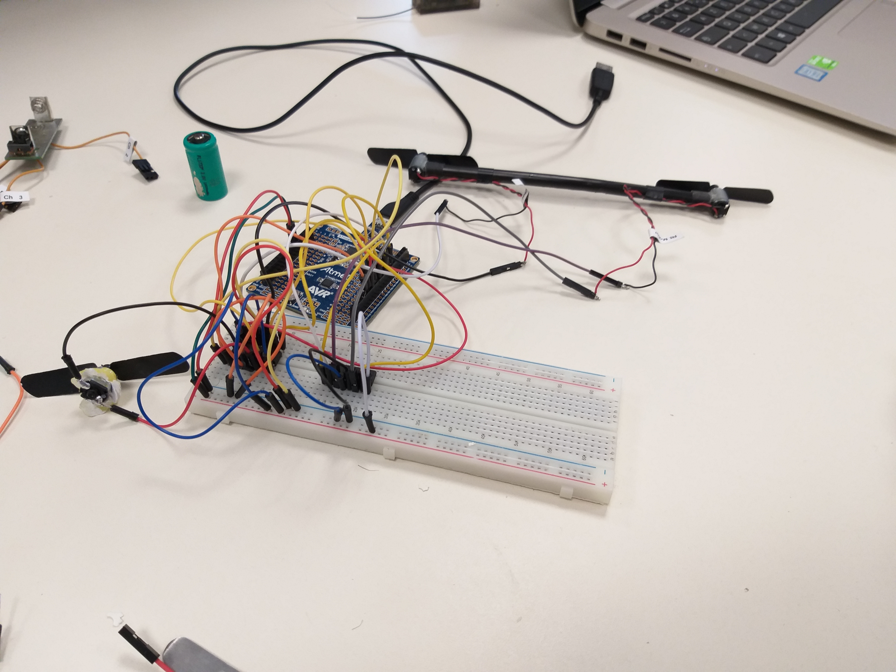

************************
<h1> Rapports de Séances</h1>

************************
 
 <h2> Travail personnel du 10 Décembre</h2>
 <ul>
  <li>Création du projet sous Github pour la remise des comptes rendus ainsi que le dépot de nos codes.</li>
  <li>Etude puis destruction du travail effectué par les étudiants de l'année dernière. 
     

 
  <li>Une fois la nacelle detruite, on connecte les fils des moteurs avec la puce L2936D selon le schéma du cours. Pour cela il a fallu resoudé les fils usés des moteurs afin de les connecté a notre plaque, et donc a notre puce. 
   
 Nous avons réussi le montage, les moteurs tournents. On a cependant pas eu le temps de connecté le moteur de controle hauteur de vol mais uniquement les moteurs de direction.
    

    

   
 Cette partie été facile car elle est similaire au Td vu en cours sur les moteurs.

 </li>
 </ul>
  <h2> Travail personnel du 17 Décembre</h2>
 <ul>
  <li>Tout d'abord, comme sur les moteurs précédents, il a fallu resouder les fils du moteurs de controle de hauteur de vol. On a ensuite brancher le moteur a une deuxieme puce. 
     

 
   </li>
  <li>Une fois la nacelle detruite, on connecte les fils des moteurs avec la puce L2936D selon le schéma du cours. Pour cela il a fallu resoudé les fils usés des moteurs afin de les connecté a notre plaque, et donc a notre puce. 
 </li>
 </ul>
 
 

