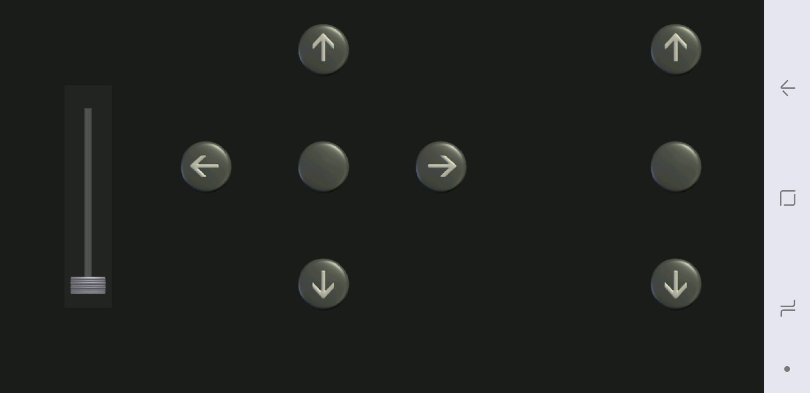
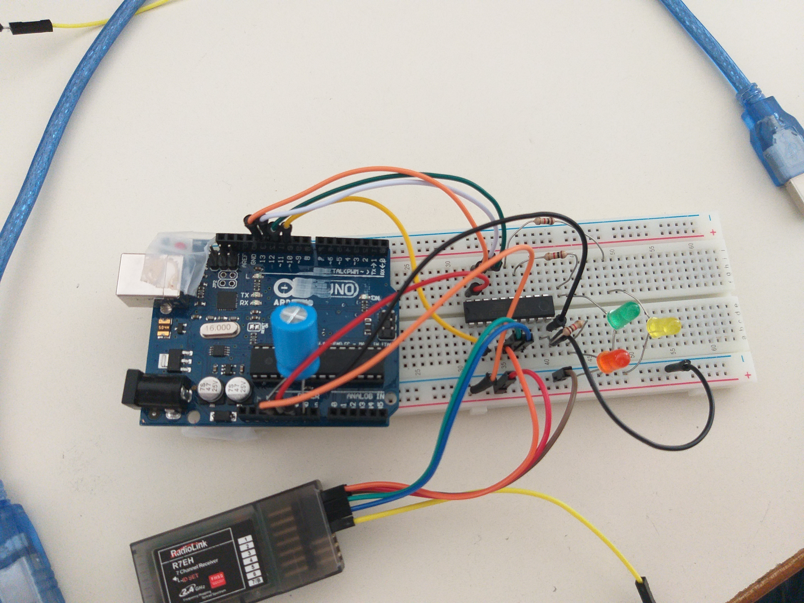

************************
<h1> Rapports de Séances</h1>

************************
 
 <h2> Travail personnel du 10 Décembre</h2>
 <ul>
  <li>Création du projet sous Github pour la remise des comptes rendus ainsi que le dépot de nos codes.</li>
  <li>Etude puis destruction du travail effectué par les étudiants de l'année dernière. 
     

 
  <li>Une fois la nacelle detruite, on connecte les fils des moteurs avec la puce L2936D selon le schéma du cours. Pour cela il a fallu resoudé les fils usés des moteurs afin de les connecté a notre plaque, et donc a notre puce. 
   
 Nous avons réussi le montage, les moteurs tournents. On a cependant pas eu le temps de connecté le moteur de controle hauteur de vol mais uniquement les moteurs de direction.
    

    

   
 Cette partie été facile car elle est similaire au Td vu en cours sur les moteurs.

 </li>
 </ul>
  <h2> Travail personnel du 17 Décembre</h2>
 <ul>
  

 
  <li>Tout d'abord, comme sur les moteurs précédents, il a fallu resouder les fils du moteurs de controle de hauteur de vol. On a ensuite brancher le moteur a une deuxieme puce L2936D .  
     

 
   </li>
 <li> Cependant il ne tournait toujours pas. Malgrés les echanges methodiques de puces, de cables, ou de moteur, on a pas reussi a localiser le probleme. C'est uniquement à la fin que nous avions vu que la masse et le 5V de la deuxieme puce n'etait pas brancher correctement. 
 </li>
 <li>Et enfin à la fin de la séance nous avons créé le premier prototype de télécommandes sur Bluetooth Electronics. Mais nous avions pas réussi à la finir et à la faire fonctionner. 
 </li>
  
 </ul>
 <h2> Travail personnel du 7 Janvier</h2>
 <ul>
 <li>On continue la communication bluetooth que nous avions debuter à la derniere séance. Cependant cela ne fonctionne pas. La communication est établie car lors des commandes "AT", le zeppelin repond nous requete. Cependant les moteurs ne tournent pas. 
 
 </li>
 <li> Aprés de nombreux tests ( on a chercher le probleme, avec peut etre un soucis de TIMER, un soucis de code ou encore un soucis de cablage), mais il semblerais que le code est juste car avec un autre moteur cela fonctionne, c'est uniquement le moteur C qui ne marche pas. On a donc verifier les cablages de la deuxieme puces, et meme utiliser un oscilloscope pour verifier l'input sur le PWM. 
</li>

<h2> Travail personnel du 14 Janvier</h2>
<ul>
 <li>
  Les moteurs ne fonctionnent pas parfaitement. Monsieur Masson a vérifié les cablâges, et nous nous étions plantés. C'est-à-dire que le cable "enable" du moteur C et du moteur B étaient inversés. Il y avait également un soucis d'OUTPUT sur le arduino.
  On a donc maintenant des moteurs qui fonctionnent, et on créé la télécommande pour contrôler les moteurs. (avant, arrière, gauche, droite, haut, bas).
   

 </li>
 <li>
  En fin de séance, aprés les oraux, nous avons peaufiné les commandes et avons ajouté une jauge qui permet de controler la vitesse de rotation des moteurs.
 </li><h2> Travail personnel du 25 février</h2>
 <ul>
  <li>Lors de cette séance nous allons nous renseigner sur la nouvelle carte Attiny2313 que nous allons utiliser et mettre dans la nacelle du zeppelin. Il a tout d'abord fallu "preparer" notre logiciel arduino afin de pouvoir utiliser la carte ATtiny.</li>
<li> Ensuite il a fallu etudier le fonctionnement du module bluetooth hc06 car nous avons une pipile de 3v , cependant on a tester avec le generateur , le module ne fonctionne pas a partir de 3.5. </li>
  <li> Il va falloir trouver une solution pour alimenter le zeppelin. Ou bien changer de module de telecommunication, par exemple le module hc12 qui accepte entre 3.2V et 5.5V</li>
<h2> Travail personnel du 11 février</h2>
  <li>Lors de cette séance on peut enfin tenter de programmer notre attiny2313 qui est enfin arriver. Cependant les premiers essais ne marchent pas. Il y a un soucis avec le logiciel arduino, il n'affiche pas dans "type de cartes" le Attiny2313,pour résoudre ce probleme il a fallu "Downgrade" vers arduino 1.0.4. Cela fonctionne cette fois-ci, mais le programme test "Blink" ne fait pas clignoter la led.</li>
  

 
  <li> Voici le cablage de l'arduion et de l'attiny2313</li>
 

 </li><h2> Travail personnel du 04 février</h2>
 <ul>
<li> 
 Pendant les vacances, Monsieur Masson nous a fais un montage pour utiliser la puce Attiny2313 et également pour utiliser l'ancienne télécommande du zeppelin car le HC06 ne pouvais pas etre alimenter par la pipile de 3V. Il nous a donc presenter le montage, et il a fallu, telecharger les bibliotheques pour Attiny2313, charger le programme ArduinoISP puis le programme de Monsieur Masson pour controler les leds avec la télécommande.
 Cependant, avec la carte Uno le montage ne fonctionnait plus, le televersement du programme ArduinoISP ne fonctionnait pas. 
 
  

  

 
   

  
  
