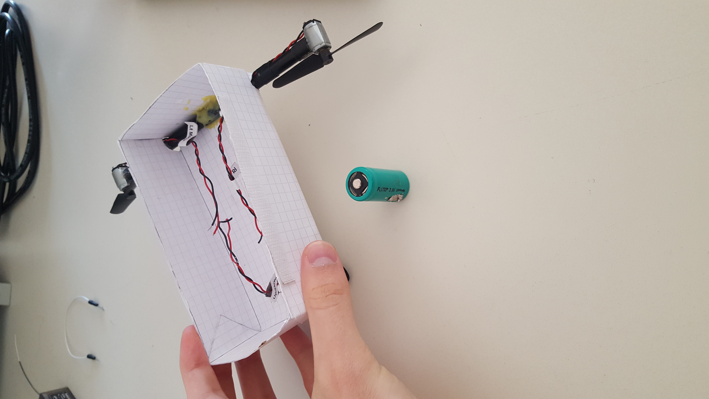
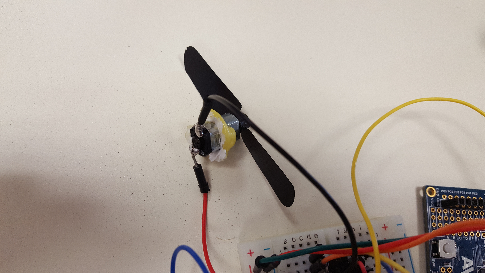
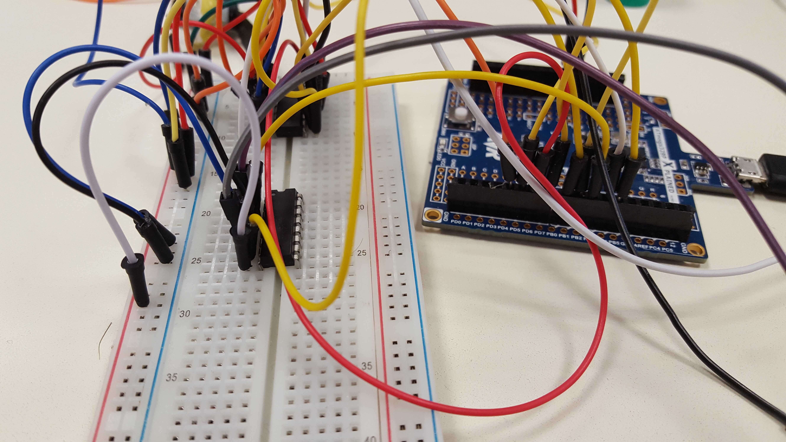
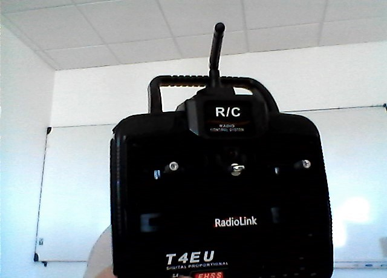
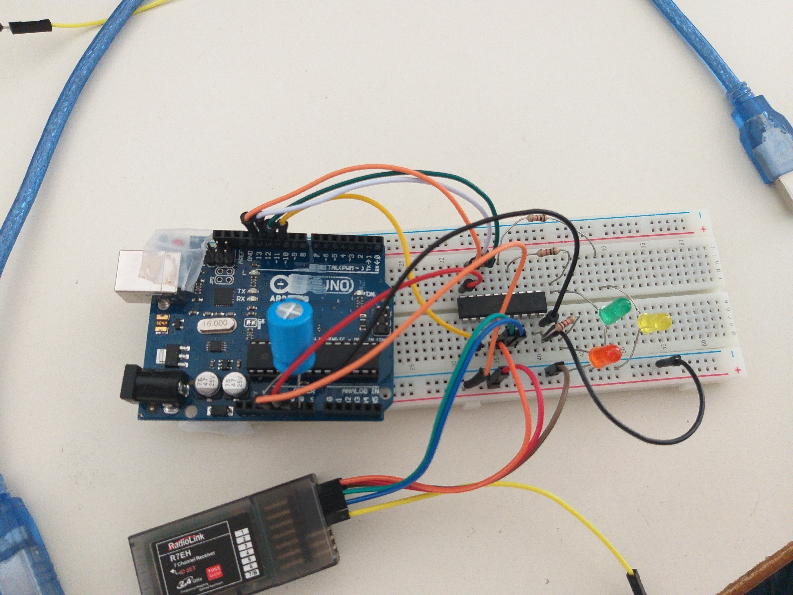
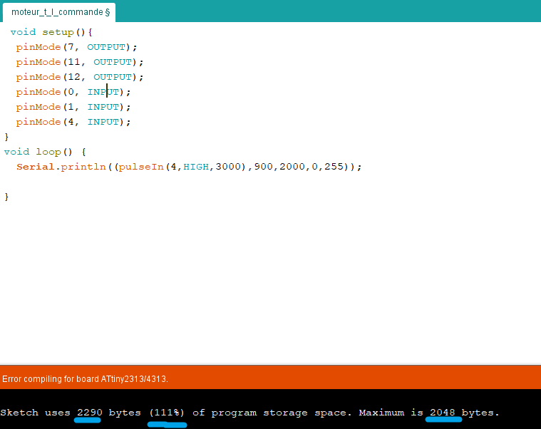
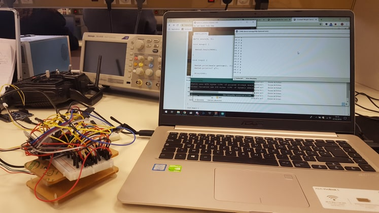
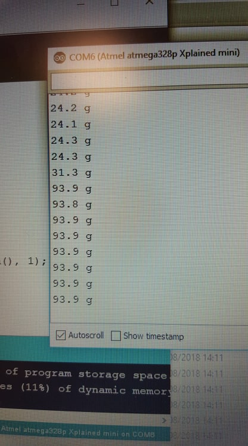

<h1><strong> Rapports de séances de RAIGE-VERGER Julien, PeiP2 G1 </strong>  </h1>

<h2> Séance du 10 décembre 2018 </h2>

 - Création du compte GitHub associé au projet, j'ai créé une "organization" pour que l'on puisse modifier les fichiers en même temps, sur deux ordinateurs différents avec deux comptes différents 
 
- Récupération de ce qu'il reste de la nacelle du zeppelin, on a juste récupéré la pile, le reste n'étant pas utile pour nous (car nous voulons contrôler le zeppelin avec le téléphone, par Bluetooth notamment) et monsieur Masson nous a donné un double pont en H.
 

- J'ai dénudé un ancien fil du moteur et je l'ai re-soudé car il était en mauvais état, ce qui rendait les branchements compliqués
- Une fois les branchements des moteurs latéraux sur la carte arduino réalisés, j'ai ré-utilisé un ancien programme (celui pour la voiture) afin de tester le fonctionnement des moteurs. 
- J'ai été agréablement surpris, tout a marché comme prévu du premier coup,le branchement était bon et les moteurs ont très bien fonctionné, voici une vidéo youtube illustrant le fonctionnement des moteurs. 
https://www.youtube.com/watch?v=F8a-x4bFFEo&feature=youtu.be 
- La semaine prochaine, il faudra brancher le dernier moteur (celui du dessous), et vérifier son fonctionnement.

 

<h2> Séance du 17 décembre 2018 </h2>

 
 • J'ai écrit le cahier des charges du projet  
 • Après que Jens ait branché le dernier moteur (celui du dessous) et que monsieur Masson nous ait donné la puce qu'il nous manquait, j'ai adapté le code de test des moteurs pour qu'il puisse tester le dernier moteur. 

 • Echec pour faire fonctionner le dernier moteur  
 • Après de nombreux essais pour trouver le problème, on a compris qu'il venait du branchement pour la deuxième puce (celle où il n'y a 
que le dernier moteur). 
  • Je me suis rendu compte que nous n'avions relié la puce au 5V et à la masse que d'un côté, alors qu'il faut le faire pour les deux, même si on fait fonctionné un seul côté.  
  • Après cette correction, le moteur s'est bien mit à tourner correctement.

 

<h2> Travail personnel pendant les vacances de Noël </h2>

Réalisation du planning  
Léger test des moteurs

 

<h2> Séance du 07 janvier 2019 </h2>

• Je reprends un code précédemment utilisé en cours (pour relier la voiture au module bluetooth), et je l'adapte pour que ça 
colle au zeppelin.  
• J'ai quelques problèmes avec le Bluetooth, mais je parviens à régler le problème (problème de code).  
• Cependant, maintenant, le Bluetooth fonctionne bien mais le moteur ne répond pas au message Bluetooth.  
• Avec l'aide de monsieur Masson, on s'est rendus compte que le problème ne venait pas du Bluetooth, car on a réussit à faire fonctionner un autre moteur avec le Bluetooth.  
• Le problème ne peut pas non plus venir du moteur car il fonctionne sans Bluetooth, donc la dernière solution est le branchage de ce moteur, qui est le moteur branché tout seul (le moteur du dessous) contrairement aux deux autres.  
• A la fin de la séance, pendant que Jens essayait de réparer le dernier moteur, j'ai adapté le programme pour faire en sorte que l'on puisse déjà contrôler les deux moteurs latéraux par Bluetooth, ce qui fonctionne bien.

 

<h2> Séance du 14 janvier 2019 </h2>

• Je me suis aperçu que deux moteurs avaient des problèmes pour s'arrêter. J'ai donc tenté de régler le problème avec le code en faisant plusieurs tests, mais je n'ai rien trouvé de concluant.  
• Monsieur Masson nous a aidé et il s'agissait en fait d'une erreur de cablâge.  
• Après avoir résolu ces problèmes de cablâge, les moteurs marchent parfaitement.  
• J'ai donc réalisé les dernières commandes élémentaires bluetooth (aller tout droit avec les deux moteurs à pleine puissance dans le même sens, reculer avec les moteurs dans l'autre sens, aller à gauche, aller à droite et couper les moteurs).  
• J'ai aussi codé les commandes du dernier moteur pour le faire touruner dans les deux sens et le faire s'arrêter grâce au Bluetooth.
Voici une vidéo qui illustre les différentes commandes que l'on peut réaliser pour l'instant avec le Bluetooth.  
https://youtu.be/4ceAmGodClM

 

<h2> Séance du 4 février 2019 </h2>

• J'ai étudié le fonctionnement du microcontrôleur ATTiny (au niveau du fonctionnement et du brochage).  
• J'ai mis à jour arduino pour pouvoir utiliser l'ATTiny85 assez rapidement (il suffisait de télécharger une librairie sur internet et de l'installer), mais c'est plus compliqué pour l'ATTiny2313 (qui nous arrangerait car il est plus grand et permet plus de branchements, notamment pour le sens avant et arrière du zeppelin.)  
• J'ai testé la tension du module Bluetooth  
• Monsieur Masson nous a donné un module HC-12, qui pourrait être intéressant car plus petit mais plus puissant, notamment par la portée du module, qui est bien plus grande que le HC-06.  
• On a donc testé le HC-12, la tension limite (basse) est de 3.2V.  Néanmoins, il ne s'agit pas de Bluetooth pour le HC-12, donc il faudrait changer le fonctionnement des déplacements du zeppelin (passer du Bluetooth à une télécommande).

 

<h2> Séance du 11 février 2019 </h2>

• Monsieur Masson nous a donné une puce ATtiny2313  
• J'avais mis à jour l'arduino pour faire fonctionner la puce ATtiny85, donc je cherche comment faire marcher la 2313.  
• Nous avons des problèmes de version par rapport au tutoriel que nous suivons.  
• Après avoir changé la version, nous n'avons plus d'erreur.  
• J'ai donc voulu tester le fonctionnement de l'ATtiny2313 avec un programme "Blink" qui doit faire clignoter la LED, mais, malgré le fait qu'il n'y ait pas d'erreurs, ça ne fonctionne pas.  

 

<h2> Séance du 25 février 2019 </h2>

 
• Monsieur Masson nous a donné l'ancienne télécommande ainsi qu'un montage et un programme car nous nous sommes rendus compte qu'il y avait un problème entre la carte que nous avions (la xplained mini) et l'ATtiny.  

 
• Nous utilisons donc maintenant une carte Uno R3 qui semble marcher sur le PC de monsieur Masson.  
• Je reproduis le montage sur notre plaque afin de faire des tests. 
                                                 
• Lorsque nous ne connectons rien à la carte, le téléversement du programme "ArduinoISP" marche bien, mais dès que l'on connecte à notre plaque, il y a une erreur de téléversement.  
• Nous avons finalement réussi à résoudre le problème en changeant quelques branchements, j'ai donc récupéré le programme de monsieur Masson afin de tester la télécommande.  
• Je vais procéder aux tests du programme chez moi durant la semaine.

 

<h2> Travail personnel durant la semaine entre le 25 février 2019 et le 4 mars 2019 </h2>

 
• J'ai commencé l'écriture du rapport du projet  
• Jens m'ayant informé d'un problème de surcharge lors de la compilation des programmes avec la nouvelle carte, j'ai envoyé un mail à Monsieur Masson afin de savoir si nous avions des solutions.

 

<h2> Séance du 04 mars 2019 </h2>

 
• J'ai adapté le code que nous possédions pour les moteurs avec Bluetooth afin qu'il puisse fonctionner sur la carte Uno avec ATTiny.
 
• Après quelques essais, je suis parvenu à créer un programme qui fait fonctionner les moteurs  
• Il a fallu régler quelques problèmes au niveau des branchements des moteurs  
• Nous avons également resoudé un des câbles du moteur qui était mal en point  
• Après avoir tout réglé, les moteurs ont bien fonctionné avec le nouveau programme  
• Malgré le bon fonctionnement des moteurs, la très faible capacité des ATTiny nous pose beaucoup de problèmes, un simple "Serial.println" pour modifier efficacement le programme est impossible.  
 
  

 

<h2> Travail personnel le 7 mars 2019 </h2>

 
• Nous avons décidé le 5 mars 2019 de revenir complètement au Bluetooth car il était très fonctionnel.  
• Nous avons également pris la décision de réaliser une nacelle fonctionnelle via Bluetooth, que nous allons relier au ballon.   
• Hélas, le ballon ne permettra sûrement pas de faire voler la nacelle car elle sera trop lourde (notamment à cause de la pile que nous venons de récupérer).  
• Nous avons pesé, à l'aide d'une balance Arduino, le poids de la carte et de la plaque, qui donne 24.1g, puis avec la pile, qui donne 93.9g.   
 
  
  
• Nous nous sommes rendus au FabLab afin de construire la nacelle. J'ai donc créé un patron de boîte avec http://carrefour-numerique.cite-sciences.fr/fablab/wiki/doku.php?id=machines:decoupe_laser:trucs_astuces:generateur_boite_encoches , puis avec le logiciel "Inkscape", j'ai réalisé quelques ouvertures qui serviront à placer les trois moteurs. Donc une ouverture sur la face du dessous pour le moteur bas et deux ouvertures sur les faces de côté pour les moteurs latéraux.  
